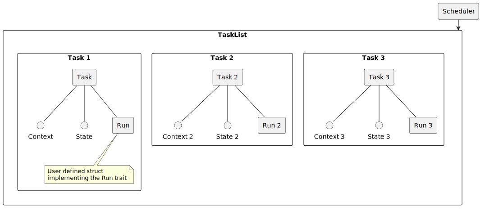
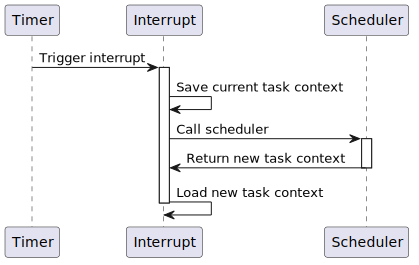

# Design Document
## Overview
This document describes the design of RusTOS, including its architecture, components, and key design decisions.

*This diagram shows the layout of the tasks.*

## Control Flow
In order to run tasks in parallel, the scheduler needs to seize control of the CPU and switch the current task. This is called a context switch. A timer is used to trigger consistent software interrupts. During these interrupts, the scheduler can decide if a context switch is necessary. If it is, the scheduler will save the current task's state and load the next task's state, allowing it to run.

*This sequence diagram show what happens when a context switch is triggered.*

## Design decisions
- **Memory allocation**: Not all embedded systems support dynamic memory allocation, so RusTOS will avoid using it. Instead, it will rely on static memory allocation and stack-based data structures.
- **Run Trait**: To construct a task in RusTOS, users will need to provide a struct that implements the `Run` trait. This allows the user to provide parameters to the task in a safe rust way, without casting a void pointer.
- **Scheduler Singleton**: The scheduler will be implemented as a singleton, ensuring that there is only one instance of the scheduler managing all tasks in the system.
